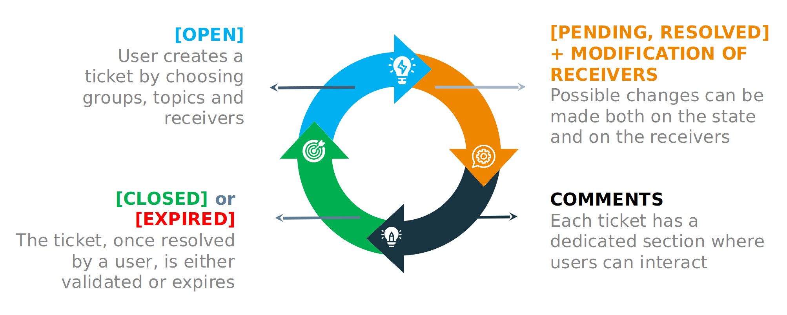
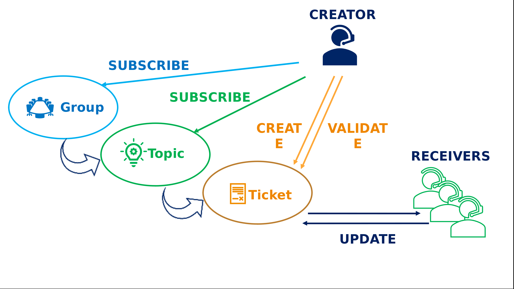

# ticketing-system
This is an example of Ticketing Management System realized for the "Application Distribuited and Mobile course" course at the University of Modena and Reggio Emilia. 

## Ticket Lifecycle




## Ticket Management




## Getting Started

### Installation

Clone Project from repo access to directory
```bash
git clone https://github.com/FedyHajali/ticketing-system.git
```
```bash
cd /.../path-to/ticketing-system
```
There are two options for starting the project:


## 1. Run with Docker 


Build Docker containers 
```bash
sudo docker-compose build
```
Start containers in detached mode
```bash
sudo docker-compose up -d
```

### <i>First setup </i>

If it's your first time running the project, perform the initial configuration below.

Make PostgreSQL migrations and create you first user as administrator of the system.

```bash
sudo docker-compose exec api python3 manage.py makemigrations
```
```bash
sudo docker-compose exec api python3 manage.py migrate
```
```bash
sudo docker exec -it api python3 manage.py createsuperuser

# docker-compose exec [docker-service] python3 manage.py [command]
```

Browse http://localhost:4200/

### <i>Stop Containers</i>

Stops and removes containers, networks, volumes, and images created by 'up' command.

```bash
sudo docker-compose down
```

## 2. Run Local 

### Backend setup

Setup virtual environment
```bash
cd backend
python -m venv .venv
source activate .venv
```
Install requirements
```bash
pip install -r requirements.txt
```

#### First Setup - Django

Make PostgreSQL migrations and create you first user as administrator of the system.

```bash
python manage.py makemigrations
```

```bash
python manage.py migrate
```

```bash
python manage.py createsuperuser
```

Launch Django Backend
```bash
python manage.py runserver
```


## Celery setup

Start redis (from /backend/redis folder):
```bash
.\redis-server.exe
```
Start beat celery scheduler:
```bash
celery -A services beat -l INFO
```
Start celery worker:
```bash
celery -A services worker --pool=solo -l info
```

## Frontend setup
 
```bash
cd frontend
```
Installation of packages:
```bash
npm install
```
Generate new API:
```bash
npm run generate-api
```
Run UI module:
```bash
npm start
```

Browse http://localhost:4200/

## Authors

Fedy Haj Ali, Giacomo Capitani
